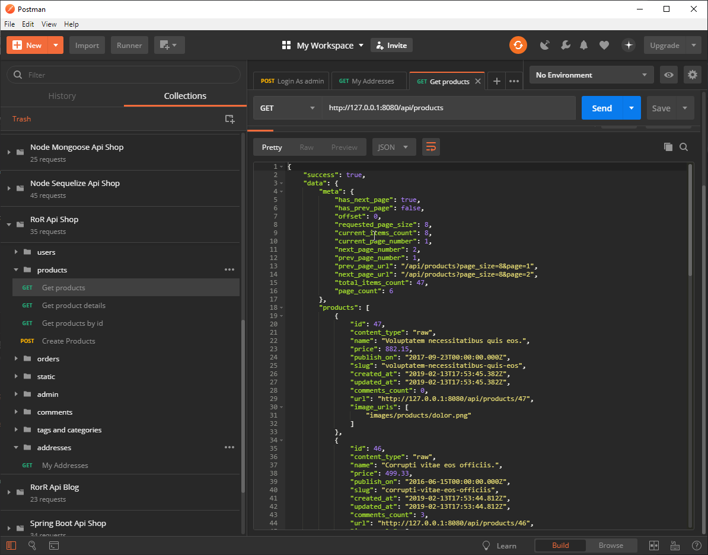
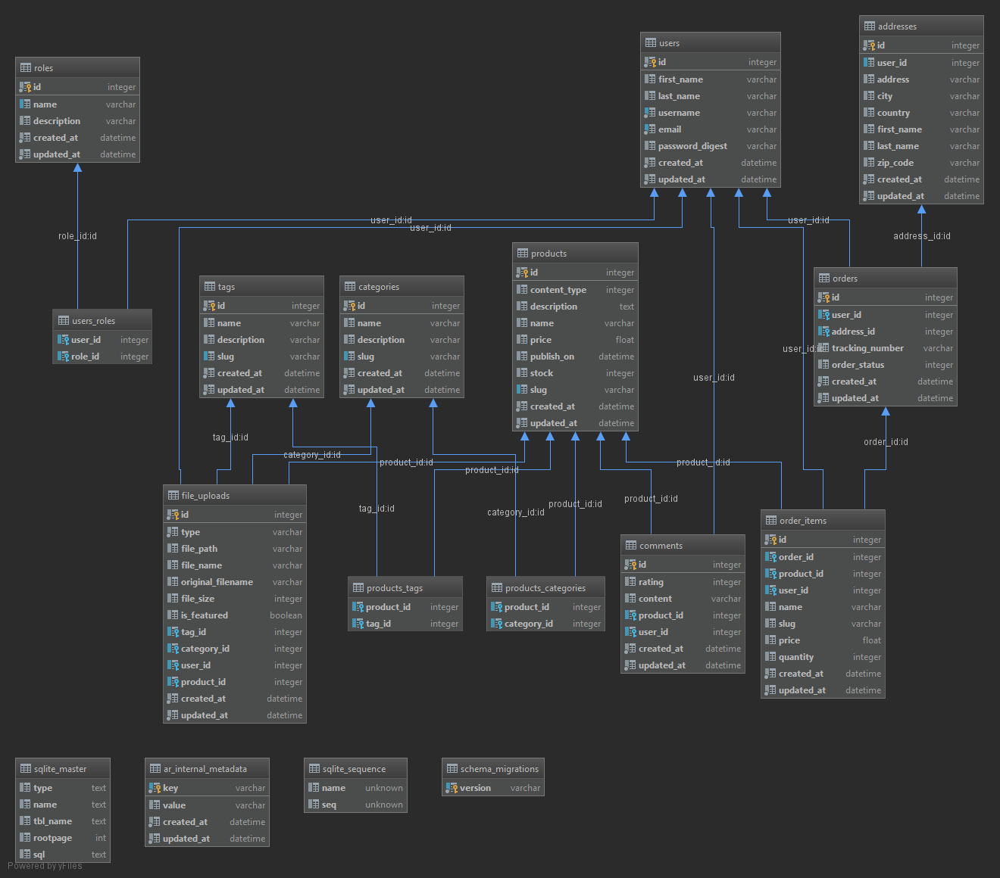

# Introduction
This is one of my E-commerce API app implementations. It is written in Java using Spring Boot and Hibernate as the main dependencies.
This is not a finished project by any means, but it has a valid enough shape to be git cloned and studied if you are interested in this topic.
If you are interested in this project take a look at my other server API implementations I have made with:

- [Node Js + Sequelize](https://github.com/melardev/ApiEcomSequelizeExpress)
- [Node Js + Bookshelf](https://github.com/melardev/ApiEcomBookshelfExpress)
- [Node Js + Mongoose](https://github.com/melardev/ApiEcomMongooseExpress)
- [Django](https://github.com/melardev/DjangoRestShopApy)
- [JavaEE Spring Boot + Hibernate](https://github.com/melardev/SBootApiEcomMVCHibernate)
- Flask I will release it in the next days
- Golang go-gonic I will release it in the next days
- AspNet Core I will release it in the next days
- AspNet MVC I will release it in the next days
- Laravel I will release it in the next days

## WARNING
I have mass of projects to deal with so I make some copy/paste around, if something I say is missing or is wrong, then I apologize
and you may let me know opening an issue.

# Getting started
1. Git clone the project
2. cd into the project
3. bundle install to make sure you install al the dependencies
4. then run `rails db:create db:seed` to create and seed the database
5. run the app with `rails server -p 8080`
6. Import api.postman_collection.json into postman and issue the requests by yourself -)

# Features
- Authentication / Authorization
- Paging
- Admin feature
- CRUD operations on products, comments, tags, categories, addresses

- Orders, guest users may place an order

# What to learn
- Rail API application
- Active Record, the rails ORM framework
    - associations: belongs_to, has_many, belongs_to_many
    - validations
- JSON builder for rails

# TODO
- Refactor the horrible orders_controller:create method
- Review all the Database queries, are they vulnerable to SQLi ?
- Narrow down the routes available, I rely on resources: but I have some of the resource methods not used
- Dockerize this application

